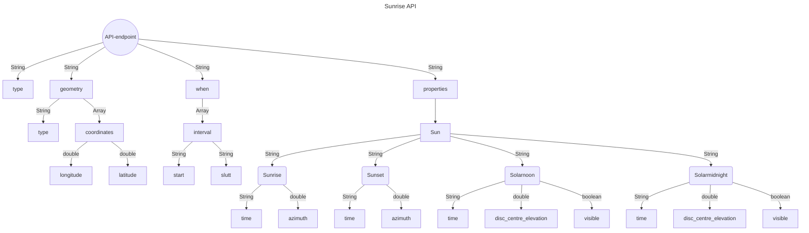

# Bruk av APIs
- OceanForecast API
- Sunrise API

## OceanForecast API
En instans av OceanForecast API'et består av et område (geometry) og områdets målinger (properties) over tid (timeseries).

### Områder (Geometry)
Områdene har forskjellige typer (point, polygon, osv.), og har hver sine koordinater (longitude and latitude). I dette API'et er det hovedsaklig områder som er av typen "point". Ettersom kvaliteten av API'et ikke er perfekt, 1km+, vil den automatisk "snappe" seg til de nærmeste koordinatene den har data på. 
Noen eksempler kan være:
1. `https://api.met.no/weatherapi/oceanforecast/2.0/complete?lat=60.10&lon=5`
2. `https://api.met.no/weatherapi/oceanforecast/2.0/complete?lat=55.20&lon=2`

Her vil 1. "snappe" til lon: 5.0012 og lat: 60.1023 og 2. til lon: 2.0297 og lat: 55.2005. 
Det er også påkrevd å ha med lat og lon i api-kallet. Hvor denne grensen er, er jeg uusikker på men vises på kartet nedenfor:

 
Datamodellen finnes [her](https://docs.api.met.no/doc/oceanforecast/datamodel).

### Målinger (Propterties)
Målingene i en API instans vil bestå av en meta som sier noe om hva slags type måleenheter som blir brukt og når den er oppdatert. I tillegg er det en timeseries som er en serie med tider den har data på. Tidene går fra en time før nærmeste hel time rundet ned, eks: Hvis man gjør et kall 19:36 så får man tiden for 18:00 også. Time serien er en liste der hvor hvert element har en tid og data. Data igjen har en instant som igjen er details, og inne i details er det alt som ligger i meta, men bare med faktisk måledata.

| NAVN | MÅLEENHET | BESKRIVELSE |
|--------|--------|-------|
| sea_surface_wave_height | meter (m) | Significant wave height defined as the average of the highest one-third (33%) of waves (measured from trough to crest) |
| sea_surface_wave_from_direction | vinkel (degree) | Wave direction follows meteorological convention. It is given as the direction the waves are coming from (0° is north, 90° east, etc.) |
| sea_water_speed | fart (m/s) | Speed of sea water (current) |
| sea_water_to_direction | vinkel (degree) | Sea water (current) direction follows oceanographic convention. It is given as the direction the sea water is moving towards (0° is north, 90° east, etc.) |
| sea_water_temperature | temperatur (celcius) | Surface temperature of sea water |

### Flowchart of the API

## Sunrise API

Sunrise
Sunrise 3.0 er en tjeneste som leverer data om sol og måne. Backenden er skrevet i Python, og kildekoden er tilgjengelig på GitHub med fri lisens.

Tjenesten leverer henholdsvis opp- og nedgangstider, samt når det to legemene krysser meridian og antimeridian. Nedenfor følger en beskrivelse av disse fenomenene.

### Oppgang/Nedgang for Solen
Oppgang for sola er det tidspunktet der det øverste punktet på soldisken krysser horisonten.

Tilsvarende for nedgang har vi tidspunktet der det øverste punktet soldisken igjen krysser horisonten på vei ned. Den astronomiske horisonten er et imaginært plan som står 90° på den aksen som peker rett opp fra observatøren, også kalt zenith.

Den visuelle solradien når den befinner seg ved horisonten er omtrent 0.266°. Ideelt sett kunne man da sagt at soloppgang inntreffer når senteret til solskiven er 0.266° under horisonten. En svært viktig faktor for når soloppgang visuelt intreffer er refraksjon grunnet Jordas atmosfære. Grunnet jordas atmosfære vil lys fra objekter i verdensrommet avbøyes og deres visuelle posisjon vil avvike fra deres faktiske posisjon. Nedenfor vises en illustrasjon av fenomenet.

Selv om lysavbøyning grunnet atmosfærens refraksjon ikke har en konstant verdi, men varierer grunnet forhold som blant varierende temperatur, har man kommet frem til en gjennomsnittsverdi på omtrent 0.566°. Legger man til den visuelle Solradien og atmosfærens refraksjon, har man har da kommet frem til en definisjon der soloppgang inntreffer når Solen er 0.833° under horisonten. For videre lesning, der vi har basert mye av vår informasjon, anbefales United States Naval Observatory sine nettsider:

https://aa.usno.navy.mil/faq/RST_defs

For månen har vi en tilsvarende definisjon. Siden Månen er nærmere enn Solen så vil dens visuelle størrelse variere i større grad der den beveger seg i sin elliptiske bane rundt jorden. Vi har likevel valgt å bruke en gjennomsnittsverdi på 0.266° for månens visuelle radius. Tatt i betrakting verdien for atmosfærens refraksjon har da månen og sola har samme definisjon på opp- og nedgang i Sunrise 3.0.

### Flowchart of the API

  

