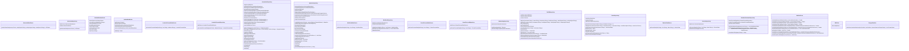

test

```mermaid
classDiagram

class AutorouteDataSource {
    getAutoRouteData(course~Point~, safetyDepth~String~, safetyHeight~String~, boatSpeed~String~) APIStatus
}

class AutorouteRepository {
    dataSource~AutorouteDataSource~
    boatDao~BoatProfileDao~
    getAutorouteData(course~Point~) APIStatus
}

class AlertNotificationCache {
    featureData~List~FeatureData~~
    enteredAlerts~MutableSet~String~~
    points~MutableList~~Point~
    alertedSunset~Boolean~
    sunsetToday~String~
    sdf~SimpleDateFormat~
    startTime~String~
    finishTime~String~
}

class UpdataDataWorker {
    appContext~Context~
    params~WorkerParams~
    metAlertsRepository~MetALertsRepository~
    sunriseRepository~SunriseRepository~
    userLocationRepository~UserLocationRepository~

    doWork() Result
}

class LocationForecastDataSource {
    getLocationForecastData(lat~String~, lon~String~, altitude~String~) LocationForecastData
}

class LocationForecastRepository {
    dataSource~LocationForecastDataSource~
    
    getLocationForecastData(point~Point~, altitude~String~) LocationForecastData
}

class AnnotationRepository {
    mapView~MapView~
    metAlertsRepository~MetAlertsRepository~
    alertPolygons~mutableListOf~AlertPolygon~~
    annotationApi~AnnotationPlugin~
    polylineAnnotationManager~PolylineAnnotationManager~
    polygonAnnotationManager~PolygonAnnotationManager~
    circleAnnotationManager~CircleAnnotationManager~
    viewAnnotationManager~ViewAnnotationManager~
    isAlertClickable~Boolean~
    alertData~List~FeatureData~~
    undoList~MutableList~Pair~Point, CircleAnnotation~~~
    redoList~MutableList~Pair~Point, CircleAnnotation~~~
    removeFromList~Pair~Point, CircleAnnotation~~
    isSelectingRoute~Boolean~
    route~MutableList~Point~~

    addLineToMap(points~List~Point~~) PolylineAnnotation
    addPolygonToMap(points~List~Point~~, fColor~String~, olColor~String~) PolygonAnnotation
    addAlertPolygons()
    toggleAlertVisibility()
    addPolygonClickListener()
    clearViewAnnoations()
    toggleRouteClicking()
    addRouteClickListener()
    userClick(point~Point~)
    addCircleToMap(point~Point~) CircleAnnotation
    getRoutePoints() List~Point~
    createRoute(autoroutePoints~List~Point~~)
    refreshRoute()
    undoCLick()
    redoClick()
}

class MpaboxRepository {
    autorouteRepository~AutorouteRepository~
    annotationRepository~AnnotationRepository~
    mapView~MapView~
    context~Context~
    isMapInitialized~MutableStateFlow~Boolean~~
    onIndicatorBearingChangeListener~OnIndicatorBearingChangedListener~
    onIndicatorPositionChangedListener~OnIndicatorPositionChangedListener~
    onMoveListener~OnMoveListener~
    initializtionMutex~Mutex~
    scope~CoroutineScope~
    
    createMap(context~Context~, cameraOptions~CameraOptions~) MapView
    onMapReady(cameraOptions~CameraOptions~)
    initLocationComponent()
    startFollowUserOnMap()
    panToUserOnMap()
    stopFollowUserOnMap()
    onCameraTrackingDismissed()
    toggleAlertVisibility()
    createLinePath(point~List~Point~~)
    convertListToPoint(points~List~List~Double~~~) List~Point~
    createRoute(points~List~Point~~)
    toggleRouteClicking()
    getRoutePoints() List~Point~
    fetchRouteData() APIStatus
    refreshRoute()
    undoClick()
    redoClick()
    generateMapURI(points~List~Point~~) String

}

class MetAlertsDataSource {
    getMetAlertsData(lat~String~, lon~String~) MetAlertsData
}

class MetAlertsRepository {
    dataSource~MetAlertsDataSource~
    metalertData~MetAlertsData~

    getMetAlertsData(lat~String~, lon~String~) MetAlertsData
    getAlertsForPoints(points~List~Point~~) List~FeatureData~
    updateAlertData()
}

class OceanForecastDataSource {
    getOceanForecastData(lat~String~, lon~String~) OceanForecastData

}

class OceanForecastRepository {
    dataSource~OceanForecastDataSource~

    getOceanForecastData(lat~String~, lon~String~) OceanForecastData
}

class OnboardingRepository {
    preferences~SharedPreferences~

    getOnboardingValue() Boolean
    setOnboardingCompleted(state~Boolean~)
}

class ProfileRepository {
    userDao~UserProfileDao~
    boatDao~BoatProfileDao~
    context~Context~

    addUser(username~String~, name~String~, boatname~String~, boatSpeed~String~, safetyDepth~String~, safetyHeight~String~)
    addBoat(username~String~, boatname~String~, boatSpeed~String~, safetyDepth~String~, safetyHeight~String~)
    startTrackingUser()
    stopTrackingUser()
    selectUser(username~String~)
    selectBoat(boatname~String~, username~String~)
    unselectUser()
    getSelectedUser(): UserProfile
    getALlUsers() List~UserProfile~
    getALlBoatsUsername(username~String~) List~BoatProfile~
    getSelectedBoatUsername(username~String~) BoatProfile
    unselectBoatUSername(username~String~)
    replaceWeatherPreference(weatherPreferences)
}

class RouteRepository {
    routeDao~RouteDao~
    context~Context~
    mapRepo~MapboxRepository~

    getLastIDUsername(username~String~, boatname~String~) Int
    addRouteUsername(username~String~, boatname~String~, routename~String~, routeDescription~String~, route~List~Point~~)
    getAllRoutesUsername(usernamne~String~) List~RouteMap~
    getStartTime() String
    getFinishTime() String
    setFinalFInishTime()
    getTemporaryRouteView(points~List~Point~~) String
    deleteRoute(routeMap~RouteMap~)
}

class SunriseDataSource {
    getSunriseData(lat~String~, lon~String~, date~String~) SunriseData
}

class SunriseRepository {
    dataSource~SunriseDataSource~
    getSunriseData(lat~String~, lon~String~, date~String~) SunriseData
    updateSunriseData(point~Point~)
}

class WeatherCalculatorRepository {
    oceanForecastRepository~OceanForecastRepository~
    locationForecastRepository~LocationForecastRepository~
    userDao~UserProfileDao~

    fetchPathWeatherData(points~List~Point~~) List~PathWeatherData~
    getWeekdayForecastData(points~List~Point~~) WeekForecast
    updateWeekForecastScore(weekForecast: WeekForecast) WeekForecast
    convertDateToDay(date~String~) String
}

class WeatherScore {
    calculateWaves(realData~Double~, preferredData~Double~) Double
    calculatePercentages(realData~Double~, preferredData~Double~) Double
    calculateTemp(realData~Double~, preferredData~Double~) Double
    calculateSpeed(realData~Double~, preferredData~Double~) Double
    calculateHour(timeWeatherData~TimeWeatherData~, weatherPreferences~WeatherPreferences~) Double
    calculateData(timeWeatherData~List~TimeWeatherData~~, weatherPreferences~WeatherPreferences~) Double
    selectWeatherDataFromDay(twd~List~TimeWeatherData~~) List~TimeWeatherData~
    getAvg(sum~Double~, size~Int~) Double
    calculateScorePath(pathWeatherData~List~PathWeatherData~~, weatherPreferences~WeatherPreferences~)
    calculateScoreWeekDay(weekForecast~WeekForecast~, weatherPreferences~WeatherPrerences~) List~DateScore~
    selectPointsFromPath(points~List~Point~~) List~Point~
}

class APIClient {
    client~HttpClient~
}

class PolygonPosition {
    checkUserLocationAlertAreas(lon~Double~, lat~Double~, featureData~ListFeatureData~) List~FeatureData~
}


```