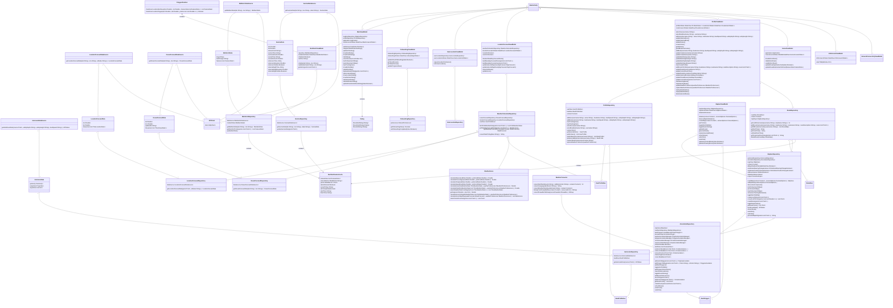

```mermaid
classDiagram

    class AutorouteDataSource {
        getAutoRouteData(course~Point~, safetyDepth~String~, safetyHeight~String~, boatSpeed~String~) APIStatus
    }

    class AutorouteRepository {
        dataSource~AutorouteDataSource~
        boatDao~BoatProfileDao~
        getAutorouteData(course~Point~) APIStatus
    }

    class AlertNotificationCache {
        featureData~List~FeatureData~~
        enteredAlerts~MutableSet~String~~
        points~MutableList~~Point~
        alertedSunset~Boolean~
        sunsetToday~String~
        sdf~SimpleDateFormat~
        startTime~String~
        finishTime~String~
    }

    class LocationForecastDataSource {
        getLocationForecastData(lat~String~, lon~String~, altitude~String~) LocationForecastData
    }

    class LocationForecastRepository {
        dataSource~LocationForecastDataSource~
        
        getLocationForecastData(point~Point~, altitude~String~) LocationForecastData
    }

    class AnnotationRepository {
        mapView~MapView~
        metAlertsRepository~MetAlertsRepository~
        alertPolygons~mutableListOf~AlertPolygon~~
        annotationApi~AnnotationPlugin~
        polylineAnnotationManager~PolylineAnnotationManager~
        polygonAnnotationManager~PolygonAnnotationManager~
        circleAnnotationManager~CircleAnnotationManager~
        viewAnnotationManager~ViewAnnotationManager~
        isAlertClickable~Boolean~
        alertData~List~FeatureData~~
        undoList~MutableList~Pair~Point, CircleAnnotation~~~
        redoList~MutableList~Pair~Point, CircleAnnotation~~~
        removeFromList~Pair~Point, CircleAnnotation~~
        isSelectingRoute~Boolean~
        route~MutableList~Point~~

        addLineToMap(points~List~Point~~) PolylineAnnotation
        addPolygonToMap(points~List~Point~~, fColor~String~, olColor~String~) PolygonAnnotation
        addAlertPolygons()
        toggleAlertVisibility()
        addPolygonClickListener()
        clearViewAnnoations()
        toggleRouteClicking()
        addRouteClickListener()
        userClick(point~Point~)
        addCircleToMap(point~Point~) CircleAnnotation
        getRoutePoints() List~Point~
        createRoute(autoroutePoints~List~Point~~)
        refreshRoute()
        undoCLick()
        redoClick()
    }

    class MapboxRepository {
        autorouteRepository~AutorouteRepository~
        annotationRepository~AnnotationRepository~
        mapView~MapView~
        context~Context~
        isMapInitialized~MutableStateFlow~Boolean~~
        onIndicatorBearingChangeListener~OnIndicatorBearingChangedListener~
        onIndicatorPositionChangedListener~OnIndicatorPositionChangedListener~
        onMoveListener~OnMoveListener~
        initializtionMutex~Mutex~
        scope~CoroutineScope~
        
        createMap(context~Context~, cameraOptions~CameraOptions~) MapView
        onMapReady(cameraOptions~CameraOptions~)
        initLocationComponent()
        startFollowUserOnMap()
        panToUserOnMap()
        stopFollowUserOnMap()
        onCameraTrackingDismissed()
        toggleAlertVisibility()
        createLinePath(point~List~Point~~)
        convertListToPoint(points~List~List~Double~~~) List~Point~
        createRoute(points~List~Point~~)
        toggleRouteClicking()
        getRoutePoints() List~Point~
        fetchRouteData() APIStatus
        refreshRoute()
        undoClick()
        redoClick()
        generateMapURI(points~List~Point~~) String

    }

    class MetAlertsDataSource {
        getMetAlertsData(lat~String~, lon~String~) MetAlertsData
    }

    class MetAlertsRepository {
        dataSource~MetAlertsDataSource~
        metalertData~MetAlertsData~

        getMetAlertsData(lat~String~, lon~String~) MetAlertsData
        getAlertsForPoints(points~List~Point~~) List~FeatureData~
        updateAlertData()
    }

    class OceanForecastDataSource {
        getOceanForecastData(lat~String~, lon~String~) OceanForecastData

    }

    class OceanForecastRepository {
        dataSource~OceanForecastDataSource~

        getOceanForecastData(lat~String~, lon~String~) OceanForecastData
    }

    class OnboardingRepository {
        preferences~SharedPreferences~

        getOnboardingValue() Boolean
        setOnboardingCompleted(state~Boolean~)
    }

    class ProfileRepository {
        userDao~UserProfileDao~
        boatDao~BoatProfileDao~
        context~Context~

        addUser(username~String~, name~String~, boatname~String~, boatSpeed~String~, safetyDepth~String~, safetyHeight~String~)
        addBoat(username~String~, boatname~String~, boatSpeed~String~, safetyDepth~String~, safetyHeight~String~)
        startTrackingUser()
        stopTrackingUser()
        selectUser(username~String~)
        selectBoat(boatname~String~, username~String~)
        unselectUser()
        getSelectedUser(): UserProfile
        getALlUsers() List~UserProfile~
        getALlBoatsUsername(username~String~) List~BoatProfile~
        getSelectedBoatUsername(username~String~) BoatProfile
        unselectBoatUSername(username~String~)
        replaceWeatherPreference(weatherPreferences)
    }

    class RouteRepository {
        routeDao~RouteDao~
        context~Context~
        mapRepo~MapboxRepository~

        getLastIDUsername(username~String~, boatname~String~) Int
        addRouteUsername(username~String~, boatname~String~, routename~String~, routeDescription~String~, route~List~Point~~)
        getAllRoutesUsername(usernamne~String~) List~RouteMap~
        getStartTime() String
        getFinishTime() String
        setFinalFInishTime()
        getTemporaryRouteView(points~List~Point~~) String
        deleteRoute(routeMap~RouteMap~)
    }

    class SunriseDataSource {
        getSunriseData(lat~String~, lon~String~, date~String~) SunriseData
    }

    class SunriseRepository {
        dataSource~SunriseDataSource~
        getSunriseData(lat~String~, lon~String~, date~String~) SunriseData
        updateSunriseData(point~Point~)
    }

    class WeatherCalculatorRepository {
        oceanForecastRepository~OceanForecastRepository~
        locationForecastRepository~LocationForecastRepository~
        userDao~UserProfileDao~

        fetchPathWeatherData(points~List~Point~~) List~PathWeatherData~
        getWeekdayForecastData(points~List~Point~~) WeekForecast
        updateWeekForecastScore(weekForecast: WeekForecast) WeekForecast
        convertDateToDay(date~String~) String
    }

    class WeatherScore {
        calculateWaves(realData~Double~, preferredData~Double~) Double
        calculatePercentages(realData~Double~, preferredData~Double~) Double
        calculateTemp(realData~Double~, preferredData~Double~) Double
        calculateSpeed(realData~Double~, preferredData~Double~) Double
        calculateHour(timeWeatherData~TimeWeatherData~, weatherPreferences~WeatherPreferences~) Double
        calculateData(timeWeatherData~List~TimeWeatherData~~, weatherPreferences~WeatherPreferences~) Double
        selectWeatherDataFromDay(twd~List~TimeWeatherData~~) List~TimeWeatherData~
        getAvg(sum~Double~, size~Int~) Double
        calculateScorePath(pathWeatherData~List~PathWeatherData~~, weatherPreferences~WeatherPreferences~)
        calculateScoreWeekDay(weekForecast~WeekForecast~, weatherPreferences~WeatherPrerences~) List~DateScore~
        selectPointsFromPath(points~List~Point~~) List~Point~
    }

    class APIClient {
        client~HttpClient~
    }

    class PolygonPosition {
        checkUserLocationAlertAreas(lon~Double~, lat~Double~, featureData~ListFeatureData~) List~FeatureData~
        checkUserLocationPolygon(lon~Double~, lat~Double~, points~List~List~Double~~~) Boolean

    }

    class WeatherConverter {
        convertAlertResId(event~String~, riskMatrixColor~String~, context~Context~) Int
        convertLanguage(alertEvent~String~) String
        convertWeatherResId(symbolCode~String~, context~Context~)
        bitmapFromDrawableRes(context~Context~, resourceId~Int~) Bitmap
        convertDrawableToBitmap(sourceDrawable~Drawable~) Bitmap
    }

    class AutorouteData {
        geometry~Geometry~
        properties~Properties~
        wayPoints~List~Int~~
    }

    class Dialog {
        ShowStartDialog~Dialog~
        ShowFinishDialog~Dialog~
        ShowNoDialog~Dialog~
    }

    class LocationForecastData {
        lon~Double~
        lat~Double~
        timeseries~List~TimeLocationData~~
    }

    class MetAlertsData {
        lang~String~
        lastChange~String~
        features~List~FeatureData~~
    }

    class OceanForecastData {
        lat~Double~
        lon~Double~

        updatedAt~String~

        timeseries~List~TimeOceanData~~

    }

    class SunriseData {
        lon~Double~
        lat~Double~
        interval~List~String~~
        sunriseTime~String~
        sunriseAzimuth~Double~
        sunsetTime~String~
        sunsetAzimuth~Double~
        solarnoonTime~String
        solarnoonElevation~Double~
        solarnoonVisible~Boolean~
        solarmidnightTime~String
        solarmidnightElevation~Double~
        solarmidnightVisible~Boolean~
    }

    class HomeViewModel {
        application~Application~
        homeScreenUIState~MutableStateFlow~HomeScreenUIState~~
        showBottomSheet()
        hideBottomSheet()
        resetBottomSheet()
        updateShowExplanationCard(state~Boolean~)
        updateShowWeatherAlertInfoCard(featureData~FeatureData~)
    }

    class MapboxViewModel {
        mapboxRepository~MapboxRepository~
        mapboxUIState~StateFlow~MapboxUIState~~
        initialized~Boolean~

        initialize(context~Context~, cameraOptions~CameraOptions~)
        observeMapInitialization()
        createMap(context~Context~, cameraOptions~CameraOptions~)
        panToUser()
        toggleAlertVisibility()
        toggleRouteClicking()
        updateRoute()
        generateRoute()
        emptyGeneratedRoute()
        refreshRoute()
        undoClick()
        redoClick()
        updateGeneratedRoute(state~Boolean~)
        updateIsDrawingRoute(state~Boolean~)
    }

    class UserLocationViewModel {
        userLocationRepository~UserLocationRepository~
        userLocationUIState~StateFlow~UserLocationUIState~~
        requestLocationPermission()
        fetchUserLocation()
    }

    class InfoScreenViewModel {
        infoScreenUIState~StateFlow~InfoScreenUIState~~
        selectTab(tabIndex~Int~)
    }

    class LocationForecastViewModel {
        weatherCalculatorRepository~WeatherCalculatorRepository~
        locationForecastUIState~StateFlow~LocationForecastUIState~~
        routeInit~Boolean~
        userInit~Boolean~
        deselectWeekDayForecastRoute()
        loadWeekdayForecastRoute(points~List~Point~~)
        loadWeekdayForecastUser(point~Point~)
        updateSelectedDayUser(dayForecast~DayForecast~)
        updateSelectedDayRoute(dayForecast~DayForecast~)
        refreshInitRoute()
        updateScore()
    }

    class MetAlertsViewModel {
        repository~MetAlertsRepository~
        metalertsUIState~StateFlow~MetAlertsUIState~~
        initialized~Boolean~
        lastPos~String~

        initialize(lat~String~, lon~String~)
        loadMetalerts(lat~String~, lon~String~)
        getAlerts(points~List~Point~~)
    }

    class OnboardingViewModel {
        onboardingRepository~OnboardingRepository~
        onboardingUIState~StateFlow~onboardingUIState~~
        updateShowOnBoarding(state~Boolean~)
        goToLastScreen()
        goToNextScreen()
        updateProgressValue()
    }

    class ProfileViewModel {
        profileUIState~StateFlow~ProfileUIState~~ createUserUIState~StateFlow~CreateUserUIState~~
        routeScreenUIState~StateFlow~RouteScreenUIState~~

        selectUser(username~String~)
        selectBoat(boatname~String~, username~String~)
        addUser(username~String~, name~String~, boatname~String~,boatSpeed~String~,safetyDepth~String~,safetyHeight~String~)
        updateSelectedUser()
        updateSelectedBoat()
        updateRoutes()
        unselectUser()
        getAllUsers()
        getAllBoatsUsername()
        addBoat(username~String~,boatname~String~,boatSpeed~String~,safetyDepth~String~,safetyHeight~String~)
        updateCreateUsername(username~String~)
        updateCreateName(name~String~)
        updateBoatName(name~String~)
        updateBoatHeight(height~String~)
        updateBoatDepth(depth~String~)
        updateBoatSpeed(speed~String~)
        clearCreateProfile()
        addRouteToProfile(username~String~,boatname~String~,routename~String~,routeDescription~String~,route~List~Point~~)
        updateRouteName(routeName~String~)
        updateCurrentRouteTime()
        updateRouteDescription(routeDescription~String~)
        updateSelectedRoute(routeMap~RouteMap~)
        updatePickedRoute(routeMap~RouteMap~)
        updateCurrentRoute(points~List~Point~~)
        startSelectingBoats()
        stopSelectingBoats()
        updateWeatherPreference(weatherPreferences~WeatherPreferences~)
        replaceWeatherPreference(weatherPreferences~WeatherPreferences~)
        startUpdateWeather()
        stopUpdateWeather()
        deleteSelectedRoute()


    }

    class MainViewModel {
        mapboxRepository~MapboxRepository~
        profileRepository~ProfileRepository~
        application~Application~
        mainScreenUIState~StateFlow~MainScreenUIState~~

        updateLaunched(state~Boolean~)
        navigateToNotificationSettings()
        updateIsTracking()
        showStartDialog()
        showFinishDialog()
        hideDialog()
        selectScreen(screenIndex~Int~)
        startFollowUserOnMap()
        stopFollowUserOnMap()
        stopTrackingUser()
        showBottomBar()
        hideBottomBar()
        displayRouteOnMap(points~List~Point~~)
        hideLocationDialog()
        showLocationDialog()
        showNoUserDialog()
        hideNoUserDialog()
        hideNotificationDialog()
        updateShowDeleteRouteDialog(state~Boolean~)

    }

AutorouteDataSource "1" -- "1" AutorouteData
AutorouteData "1" -- "1" AutorouteRepository
AutorouteRepository "1" -- "1" BoatProfileDao

LocationForecastDataSource "1" -- "1" LocationForecastData 
LocationForecastData "1" -- "1" LocationForecastRepository
LocationForecastDataSource "1" -- "1" APIClient

OceanForecastDataSource "1" -- "1" OceanForecastData
OceanForecastData "1" -- "1" OceanForecastRepository
OceanForecastDataSource "1" -- "1" APIClient

SunriseDataSource "1" -- "1" SunriseData
SunriseData "1" -- "1" SunriseRepository
SunriseDataSource "1" -- "1" APIClient

MetAlertsDataSource "1" -- "1" MetAlertsData
MetAlertsData "1" -- "1" MetAlertsRepository
MetAlertsDataSource "1" -- "1" APIClient
MetAlertsViewModel "1" -- "1" MetAlertsRepository 

MapboxRepository "1" -- "1" AnnotationRepository
MapboxRepository "1" -- "1" AutorouteRepository

ProfileRepository "1" -- "1" UserProfileDao
ProfileRepository "1" -- "1" BoatProfileDao

RouteRepository "1" -- "1" RouteDao
RouteRepository "1" -- "1" MapboxRepository

WeatherCalculatorRepository "1" -- "1" OceanForecastRepository
WeatherCalculatorRepository "1" -- "1" LocationForecastRepository
WeatherCalculatorRepository "1" -- "1" UserProfileDao
WeatherCalculatorRepository "1" -- "1" WeatherScore

MapboxViewModel "1" -- "1" MapboxRepository
MapboxViewModel "1" -- "1" AlertPolygon

UserLocationViewModel "1" -- "1" UserLocationRepository

LocationForecastViewModel "1" -- "1" WeatherCalculatorRepository


OnboardingViewModel "1" -- "1" OnboardingRepository

ProfileViewModel "1" -- "1" ProfileRepository
ProfileViewModel "1" -- "1" RouteRepository

MainActivity "1" -- "1" MainViewModel
MainActivity "1" -- "1" MetAlertsViewModel
MainActivity "1" -- "1" OnboardingViewModel
MainActivity "1" -- "1" UserLocationViewModel
MainActivity "1" -- "1" LocationForecastViewModel
MainActivity "1" -- "1" ProfileViewModel
MainActivity "1" -- "1" HomeViewModel
MainActivity "1" -- "1" InfoScreenViewModel
MainActivity "1" -- "1" NetworkConnectivityViewModel

PolygonPosition <-- MetAlertsViewModel: contains

WeatherConverter "1" -- "1" AnnotationRepository

MainViewModel --> Dialog: contains

AnnotationRepository --> AlertPolygon

MetAlertsRepository --> AlertNotificationCache: contains
SunriseRepository --> AlertNotificationCache: contains
RouteRepository --> AlertNotificationCache: contains
```