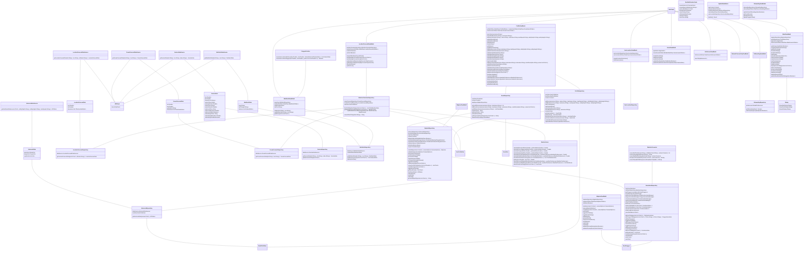

```mermaid
classDiagram

AutorouteDataSource -- AutorouteData
AutorouteData -- AutorouteRepository
AutorouteRepository -- BoatProfileDao

LocationForecastDataSource -- LocationForecastData 
LocationForecastData -- LocationForecastRepository
LocationForecastDataSource -- APIClient

OceanForecastDataSource -- OceanForecastData
OceanForecastData -- OceanForecastRepository
OceanForecastDataSource -- APIClient

SunriseDataSource -- SunriseData
SunriseData -- SunriseRepository
SunriseDataSource -- APIClient

MetAlertsDataSource -- MetAlertsData
MetAlertsData -- MetAlertsRepository
MetAlertsDataSource -- APIClient
MetAlertsViewModel -- MetAlertsRepository 

MapboxRepository -- AnnotationRepository
MapboxRepository -- AutorouteRepository

ProfileRepository -- UserProfileDao
ProfileRepository -- BoatProfileDao

RouteRepository -- RouteDao
RouteRepository -- MapboxRepository

WeatherCalculatorRepository -- OceanForecastRepository
WeatherCalculatorRepository -- LocationForecastRepository
WeatherCalculatorRepository -- UserProfileDao
WeatherCalculatorRepository -- WeatherScore

MapboxCiewModel -- MapboxRepository
MapboxViewModel -- AlertPolygon

UserLocationViewModel -- UserLocationRepository

LocationForecastViewModel -- WeatherCalculatorRepository


OnBoardingViewModel -- OnboardingRepository

ProfileViewModel -- ProfileRepository
ProfileViewModel -- RouteRepository

NavGraph -- MainViewModel
NavGraph -- MetAlertsViewModel
NavGraph -- OnBoardingViewModel
NavGraph -- UserLocationViewModel
NavGraph -- LocationForecastViewModel
NavGraph -- ProfileViewModel
NavGraph -- HomeViewModel
NavGraph -- InfoScreenViewModel
NavGraph -- NetworkConnectivityViewModel

PolygonPosition -- MetAlertsViewModel

WeatherConverter -- AnnotationRepository

MainViewModel -- Dialog

AnnotationRepository -- AlertPolygon


class AutorouteDataSource {
    getAutoRouteData(course~Point~, safetyDepth~String~, safetyHeight~String~, boatSpeed~String~) APIStatus
}

class AutorouteRepository {
    dataSource~AutorouteDataSource~
    boatDao~BoatProfileDao~
    getAutorouteData(course~Point~) APIStatus
}

class AlertNotificationCache {
    featureData~List~FeatureData~~
    enteredAlerts~MutableSet~String~~
    points~MutableList~~Point~
    alertedSunset~Boolean~
    sunsetToday~String~
    sdf~SimpleDateFormat~
    startTime~String~
    finishTime~String~
}

class UpdataDataWorker {
    appContext~Context~
    params~WorkerParams~
    metAlertsRepository~MetALertsRepository~
    sunriseRepository~SunriseRepository~
    userLocationRepository~UserLocationRepository~

    doWork() Result
}

class LocationForecastDataSource {
    getLocationForecastData(lat~String~, lon~String~, altitude~String~) LocationForecastData
}

class LocationForecastRepository {
    dataSource~LocationForecastDataSource~
    
    getLocationForecastData(point~Point~, altitude~String~) LocationForecastData
}

class AnnotationRepository {
    mapView~MapView~
    metAlertsRepository~MetAlertsRepository~
    alertPolygons~mutableListOf~AlertPolygon~~
    annotationApi~AnnotationPlugin~
    polylineAnnotationManager~PolylineAnnotationManager~
    polygonAnnotationManager~PolygonAnnotationManager~
    circleAnnotationManager~CircleAnnotationManager~
    viewAnnotationManager~ViewAnnotationManager~
    isAlertClickable~Boolean~
    alertData~List~FeatureData~~
    undoList~MutableList~Pair~Point, CircleAnnotation~~~
    redoList~MutableList~Pair~Point, CircleAnnotation~~~
    removeFromList~Pair~Point, CircleAnnotation~~
    isSelectingRoute~Boolean~
    route~MutableList~Point~~

    addLineToMap(points~List~Point~~) PolylineAnnotation
    addPolygonToMap(points~List~Point~~, fColor~String~, olColor~String~) PolygonAnnotation
    addAlertPolygons()
    toggleAlertVisibility()
    addPolygonClickListener()
    clearViewAnnoations()
    toggleRouteClicking()
    addRouteClickListener()
    userClick(point~Point~)
    addCircleToMap(point~Point~) CircleAnnotation
    getRoutePoints() List~Point~
    createRoute(autoroutePoints~List~Point~~)
    refreshRoute()
    undoCLick()
    redoClick()
}

class MapboxRepository {
    autorouteRepository~AutorouteRepository~
    annotationRepository~AnnotationRepository~
    mapView~MapView~
    context~Context~
    isMapInitialized~MutableStateFlow~Boolean~~
    onIndicatorBearingChangeListener~OnIndicatorBearingChangedListener~
    onIndicatorPositionChangedListener~OnIndicatorPositionChangedListener~
    onMoveListener~OnMoveListener~
    initializtionMutex~Mutex~
    scope~CoroutineScope~
    
    createMap(context~Context~, cameraOptions~CameraOptions~) MapView
    onMapReady(cameraOptions~CameraOptions~)
    initLocationComponent()
    startFollowUserOnMap()
    panToUserOnMap()
    stopFollowUserOnMap()
    onCameraTrackingDismissed()
    toggleAlertVisibility()
    createLinePath(point~List~Point~~)
    convertListToPoint(points~List~List~Double~~~) List~Point~
    createRoute(points~List~Point~~)
    toggleRouteClicking()
    getRoutePoints() List~Point~
    fetchRouteData() APIStatus
    refreshRoute()
    undoClick()
    redoClick()
    generateMapURI(points~List~Point~~) String

}

class MetAlertsDataSource {
    getMetAlertsData(lat~String~, lon~String~) MetAlertsData
}

class MetAlertsRepository {
    dataSource~MetAlertsDataSource~
    metalertData~MetAlertsData~

    getMetAlertsData(lat~String~, lon~String~) MetAlertsData
    getAlertsForPoints(points~List~Point~~) List~FeatureData~
    updateAlertData()
}

class OceanForecastDataSource {
    getOceanForecastData(lat~String~, lon~String~) OceanForecastData

}

class OceanForecastRepository {
    dataSource~OceanForecastDataSource~

    getOceanForecastData(lat~String~, lon~String~) OceanForecastData
}

class OnboardingRepository {
    preferences~SharedPreferences~

    getOnboardingValue() Boolean
    setOnboardingCompleted(state~Boolean~)
}

class ProfileRepository {
    userDao~UserProfileDao~
    boatDao~BoatProfileDao~
    context~Context~

    addUser(username~String~, name~String~, boatname~String~, boatSpeed~String~, safetyDepth~String~, safetyHeight~String~)
    addBoat(username~String~, boatname~String~, boatSpeed~String~, safetyDepth~String~, safetyHeight~String~)
    startTrackingUser()
    stopTrackingUser()
    selectUser(username~String~)
    selectBoat(boatname~String~, username~String~)
    unselectUser()
    getSelectedUser(): UserProfile
    getALlUsers() List~UserProfile~
    getALlBoatsUsername(username~String~) List~BoatProfile~
    getSelectedBoatUsername(username~String~) BoatProfile
    unselectBoatUSername(username~String~)
    replaceWeatherPreference(weatherPreferences)
}

class RouteRepository {
    routeDao~RouteDao~
    context~Context~
    mapRepo~MapboxRepository~

    getLastIDUsername(username~String~, boatname~String~) Int
    addRouteUsername(username~String~, boatname~String~, routename~String~, routeDescription~String~, route~List~Point~~)
    getAllRoutesUsername(usernamne~String~) List~RouteMap~
    getStartTime() String
    getFinishTime() String
    setFinalFInishTime()
    getTemporaryRouteView(points~List~Point~~) String
    deleteRoute(routeMap~RouteMap~)
}

class SunriseDataSource {
    getSunriseData(lat~String~, lon~String~, date~String~) SunriseData
}

class SunriseRepository {
    dataSource~SunriseDataSource~
    getSunriseData(lat~String~, lon~String~, date~String~) SunriseData
    updateSunriseData(point~Point~)
}

class WeatherCalculatorRepository {
    oceanForecastRepository~OceanForecastRepository~
    locationForecastRepository~LocationForecastRepository~
    userDao~UserProfileDao~

    fetchPathWeatherData(points~List~Point~~) List~PathWeatherData~
    getWeekdayForecastData(points~List~Point~~) WeekForecast
    updateWeekForecastScore(weekForecast: WeekForecast) WeekForecast
    convertDateToDay(date~String~) String
}

class WeatherScore {
    calculateWaves(realData~Double~, preferredData~Double~) Double
    calculatePercentages(realData~Double~, preferredData~Double~) Double
    calculateTemp(realData~Double~, preferredData~Double~) Double
    calculateSpeed(realData~Double~, preferredData~Double~) Double
    calculateHour(timeWeatherData~TimeWeatherData~, weatherPreferences~WeatherPreferences~) Double
    calculateData(timeWeatherData~List~TimeWeatherData~~, weatherPreferences~WeatherPreferences~) Double
    selectWeatherDataFromDay(twd~List~TimeWeatherData~~) List~TimeWeatherData~
    getAvg(sum~Double~, size~Int~) Double
    calculateScorePath(pathWeatherData~List~PathWeatherData~~, weatherPreferences~WeatherPreferences~)
    calculateScoreWeekDay(weekForecast~WeekForecast~, weatherPreferences~WeatherPrerences~) List~DateScore~
    selectPointsFromPath(points~List~Point~~) List~Point~
}

class APIClient {
    client~HttpClient~
}

class PolygonPosition {
    checkUserLocationAlertAreas(lon~Double~, lat~Double~, featureData~ListFeatureData~) List~FeatureData~
    checkUserLocationPolygon(lon~Double~, lat~Double~, points~List~List~Double~~~) Boolean

}

class WeatherConverter {
    convertAlertResId(event~String~, riskMatrixColor~String~, context~Context~) Int
    convertLanguage(alertEvent~String~) String
    convertWeatherResId(symbolCode~String~, context~Context~)
    bitmapFromDrawableRes(context~Context~, resourceId~Int~) Bitmap
    convertDrawableToBitmap(sourceDrawable~Drawable~) Bitmap
}

class AutorouteData {
    geometry~Geometry~
    properties~Properties~
    wayPoints~List~Int~~
}

class Dialog {
    ShowStartDialog~Dialog~
    ShowFinishDialog~Dialog~
    ShowNoDialog~Dialog~
}

class LocationForecastData {
    lon~Double~
    lat~Double~
    timeseries~List~TimeLocationData~~
}

class MetAlertsData {
    lang~String~
    lastChange~String~
    features~List~FeatureData~~
}

class OceanForecastData {
    lat~Double~
    lon~Double~

    updatedAt~String~

    timeseries~List~TimeOceanData~~

}

class SunriseData {
    lon~Double~
    lat~Double~
    interval~List~String~~
    sunriseTime~String~
    sunriseAzimuth~Double~
    sunsetTime~String~
    sunsetAzimuth~Double~
    solarnoonTime~String
    solarnoonElevation~Double~
    solarnoonVisible~Boolean~
    solarmidnightTime~String
    solarmidnightElevation~Double~
    solarmidnightVisible~Boolean~
}

class HomeViewModel {
    application~Application~
    homeScreenUIState~MutableStateFlow~HomeScreenUIState~~
    showBottomSheet()
    hideBottomSheet()
    resetBottomSheet()
    updateShowExplanationCard(state~Boolean~)
    updateShowWeatherAlertInfoCard(featureData~FeatureData~)
}

class MapboxViewModel {
    mapboxRepository~MapboxRepository~
    mapboxUIState~StateFlow~MapboxUIState~~
    initialized~Boolean~

    initialize(context~Context~, cameraOptions~CameraOptions~)
    observeMapInitialization()
    createMap(context~Context~, cameraOptions~CameraOptions~)
    panToUser()
    toggleAlertVisibility()
    toggleRouteClicking()
    updateRoute()
    generateRoute()
    emptyGeneratedRoute()
    refreshRoute()
    undoClick()
    redoClick()
    updateGeneratedRoute(state~Boolean~)
    updateIsDrawingRoute(state~Boolean~)
}

class UserLocationViewModel {
    userLocationRepository~UserLocationRepository~
    userLocationUIState~StateFlow~UserLocationUIState~~
    requestLocationPermission()
    fetchUserLocation()
}

class InfoScreenViewModel {
    infoScreenUIState~StateFlow~InfoScreenUIState~~
    selectTab(tabIndex~Int~)
}

class LocationForecastViewModel {
    weatherCalculatorRepository~WeatherCalculatorRepository~
    locationForecastUIState~StateFlow~LocationForecastUIState~~
    routeInit~Boolean~
    userInit~Boolean~
    deselectWeekDayForecastRoute()
    loadWeekdayForecastRoute(points~List~Point~~)
    loadWeekdayForecastUser(point~Point~)
    updateSelectedDayUser(dayForecast~DayForecast~)
    updateSelectedDayRoute(dayForecast~DayForecast~)
    refreshInitRoute()
    updateScore()
}

class MetAlertsViewModel {
    repository~MetAlertsRepository~
    metalertsUIState~StateFlow~MetAlertsUIState~~
    initialized~Boolean~
    lastPos~String~

    initialize(lat~String~, lon~String~)
    loadMetalerts(lat~String~, lon~String~)
    getAlerts(points~List~Point~~)
}

class OnboardingViewModel {
    onboardingRepository~OnboardingRepository~
    onboardingUIState~StateFlow~onboardingUIState~~
    updateShowOnBoarding(state~Boolean~)
    goToLastScreen()
    goToNextScreen()
    updateProgressValue()
}

class ProfileViewModel {
    profileUIState~StateFlow~ProfileUIState~~ createUserUIState~StateFlow~CreateUserUIState~~
    routeScreenUIState~StateFlow~RouteScreenUIState~~

    selectUser(username~String~)
    selectBoat(boatname~String~, username~String~)
    addUser(username~String~, name~String~, boatname~String~,boatSpeed~String~,safetyDepth~String~,safetyHeight~String~)
    updateSelectedUser()
    updateSelectedBoat()
    updateRoutes()
    unselectUser()
    getAllUsers()
    getAllBoatsUsername()
    addBoat(username~String~,boatname~String~,boatSpeed~String~,safetyDepth~String~,safetyHeight~String~)
    updateCreateUsername(username~String~)
    updateCreateName(name~String~)
    updateBoatName(name~String~)
    updateBoatHeight(height~String~)
    updateBoatDepth(depth~String~)
    updateBoatSpeed(speed~String~)
    clearCreateProfile()
    addRouteToProfile(username~String~,boatname~String~,routename~String~,routeDescription~String~,route~List~Point~~)
    updateRouteName(routeName~String~)
    updateCurrentRouteTime()
    updateRouteDescription(routeDescription~String~)
    updateSelectedRoute(routeMap~RouteMap~)
    updatePickedRoute(routeMap~RouteMap~)
    updateCurrentRoute(points~List~Point~~)
    startSelectingBoats()
    stopSelectingBoats()
    updateWeatherPreference(weatherPreferences~WeatherPreferences~)
    replaceWeatherPreference(weatherPreferences~WeatherPreferences~)
    startUpdateWeather()
    stopUpdateWeather()
    deleteSelectedRoute()


}

class MainViewModel {
    mapboxRepository~MapboxRepository~
    profileRepository~ProfileRepository~
    application~Application~
    mainScreenUIState~StateFlow~MainScreenUIState~~

    updateLaunched(state~Boolean~)
    navigateToNotificationSettings()
    updateIsTracking()
    showStartDialog()
    showFinishDialog()
    hideDialog()
    selectScreen(screenIndex~Int~)
    startFollowUserOnMap()
    stopFollowUserOnMap()
    stopTrackingUser()
    showBottomBar()
    hideBottomBar()
    displayRouteOnMap(points~List~Point~~)
    hideLocationDialog()
    showLocationDialog()
    showNoUserDialog()
    hideNoUserDialog()
    hideNotificationDialog()
    updateShowDeleteRouteDialog(state~Boolean~)

}


```