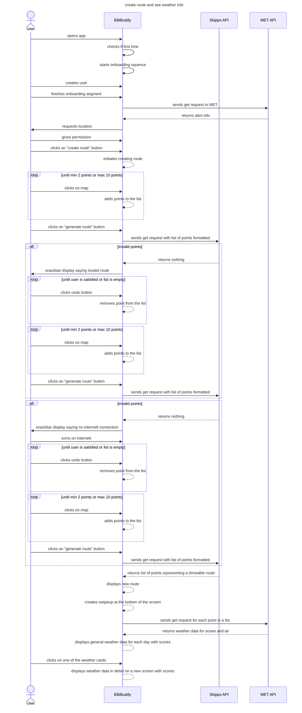

Tekstlig beskrivelse av "Været for en rute"
-
Aktører: Bruker, Skippo, Metrologisk institutt
Prebetingelse: Bruker har ikke åpnet appen før. APIene sine servere er ikke nede.
Postbetingelse: Været for en rute generert vises på skjermen.

Hovedflyt: 
1. Bruker åpner app og starter onboarding.
2. Bruker lager profil.
3. Onboarding er ferdig.
4. Bruker legger inn minimum 2 punkter på kartet.
5. Bruker trykker generer rute når de er ferdig med å legge inn punkter.
6. Rute tegnes på kartet, kommer swipe-up med værdata og varsler for ruten de neste dagene.
7. Bruker trykker på weather cards.

Alternativ flyt:
6.1.1. Rute tegnes ikke på kartet grunnet dårlig plassert punkter.
6.1.2. Hopper til punkt 4.

6.2.1. Bruker har ikke aktivert internett.
6.2.2. Bruker aktiverer internett.
6.2.3. Hopper til punkt 4.

