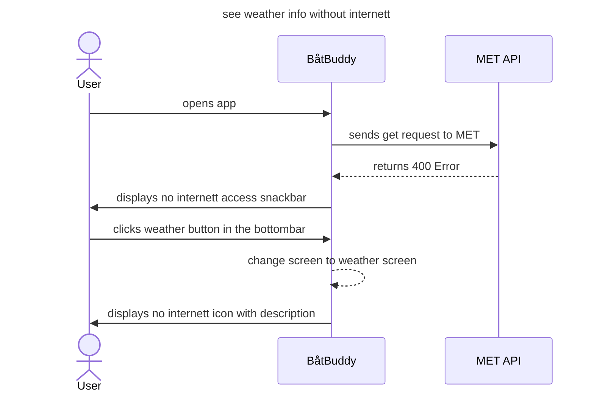

Tekstlig beskrivelse av "Været for posisjon"
-
Aktører: Bruker, Metrologisk institutt
Prebetingelse: Bruker har åpnet appen før, APIene er nede
Postbetingelse: Bruker får ikke værdata.

Hovedflyt: 
1. Bruker åpner app
2. Bruker trykker på 'været' knappen i bottombaren
3. Bruker får ikke værdata

