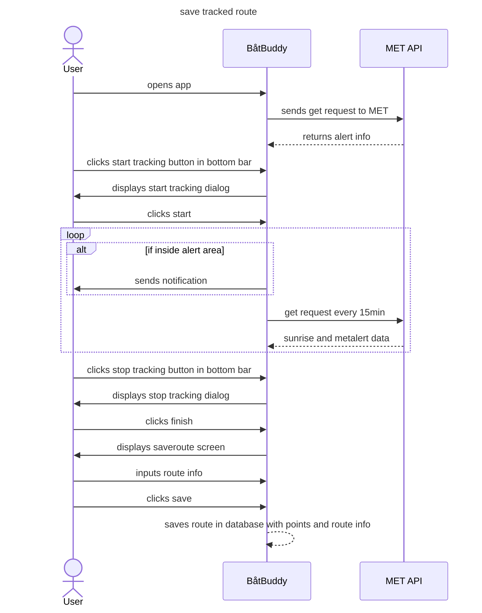

Tekstlig beskrivelse av "Været for posisjon"
-
Aktører: Bruker, Metrologisk institutt.  
Prebetingelse: Bruker har åpnet appen før, Bruker har gitt posisjon og notifikasjons tillatelser, Bruker har internett til alle tider.  
Postbetingelse: Bruker lagrer rute i databasen

Hovedflyt: 
1. Bruker åpner app.
2. Bruker starter sporing av rute
3. Bruker avslutter sporing av rute
4. Bruker lagrer ruten

